# VoxFlow 详细设计文档

> **项目代号：** VoxFlow (Voice Flow)
> **版本：** v0.1.0-draft
> **日期：** 2026-03-26
> **基于：** [0001-spec.md](./0001-spec.md)

---

## 目录

1. [项目概述](#1-项目概述)
2. [系统架构总览](#2-系统架构总览)
3. [技术选型与依赖矩阵](#3-技术选型与依赖矩阵)
4. [模块详细设计](#4-模块详细设计)
   - 4.1 [Rust 核心层 (src-tauri)](#41-rust-核心层-src-tauri)
   - 4.2 [TypeScript 应用层 (src)](#42-typescript-应用层-src)
   - 4.3 [ElevenLabs Scribe v2 集成层](#43-elevenlabs-scribe-v2-集成层)
5. [数据流与 IPC 通信设计](#5-数据流与-ipc-通信设计)
6. [核心算法设计](#6-核心算法设计)
7. [权限与安全设计](#7-权限与安全设计)
8. [项目目录结构](#8-项目目录结构)
9. [关键接口定义](#9-关键接口定义)
10. [降级与容错策略](#10-降级与容错策略)
11. [性能指标与约束](#11-性能指标与约束)
12. [开发里程碑](#12-开发里程碑)

---

## 1. 项目概述

VoxFlow 是一款基于 Tauri v2 + Rust 的高性能 macOS 桌面应用，实现系统级实时语音转文本功能。应用常驻菜单栏，通过全局快捷键 `Cmd+Shift+\` 触发"按住说话"模式，将麦克风音频流实时发送至 ElevenLabs Scribe v2 API，并将转写结果无缝注入当前活跃应用的文本输入焦点处。

### 1.1 核心功能清单

| 功能 | 描述 | 优先级 |
|---|---|---|
| 菜单栏常驻 | 无 Dock 图标，菜单栏图标 + 弹出设置窗口 | P0 |
| 全局快捷键 | `Cmd+Shift+\` 按住说话 / 松开停止 | P0 |
| 音频采集 | Rust cpal 16kHz Mono S16LE PCM 低延迟采集 | P0 |
| WebSocket 转写 | ElevenLabs Scribe v2 Realtime API 集成 | P0 |
| 差异化文本注入 | Backspace Difference Algorithm + CGEvent 模拟按键 | P0 |
| 焦点检测 | macOS Accessibility API 探测可编辑区域 | P0 |
| 剪切板降级 | 注入失败时自动复制到剪切板 + 通知 | P0 |
| 上下文注入 | previous_text 获取光标前文本提升识别精度 | P1 |
| 设置界面 | API Key 管理、快捷键自定义、语言选择 | P1 |
| 转写历史 | 本地存储历史转写记录 | P2 |

---

## 2. 系统架构总览

### 2.1 四层架构模型

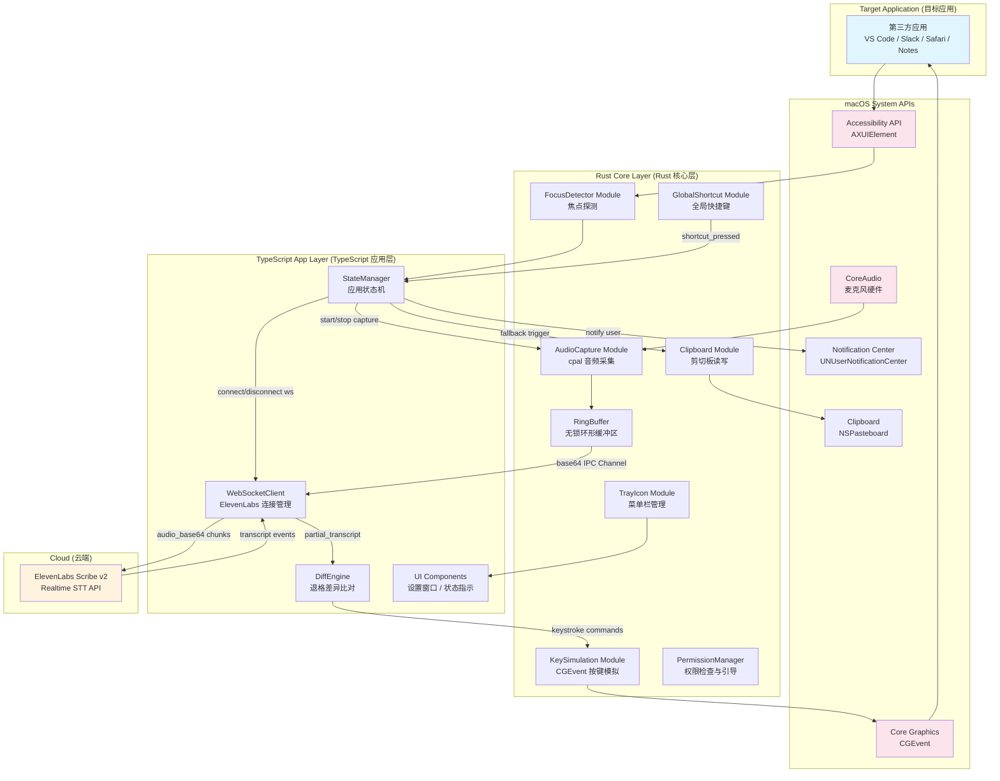

### 2.2 进程模型

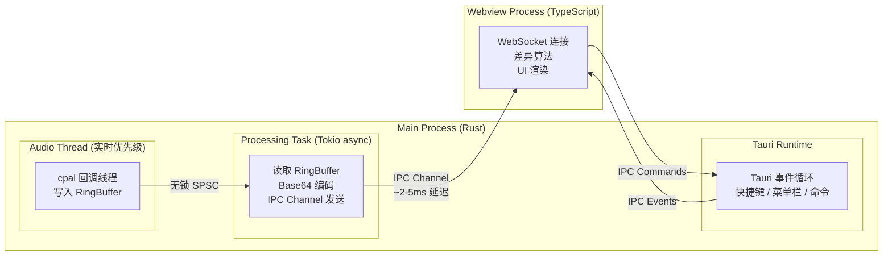

---

## 3. 技术选型与依赖矩阵

### 3.1 Rust 依赖 (src-tauri/Cargo.toml)

| Crate | 版本 | 用途 | 关键说明 |
|---|---|---|---|
| `tauri` | `2.10` | 应用框架 | features: `["tray-icon"]` |
| `tauri-build` | `2.5` | 构建时代码生成 | build-dependencies |
| `tauri-plugin-global-shortcut` | `2.2` | 全局快捷键 | `Shortcut::new(Some(Modifiers::SUPER \| Modifiers::SHIFT), Code::Backslash)` |
| `tauri-plugin-clipboard-manager` | `2.3` | 剪切板操作 | 降级时写入转写文本 |
| `tauri-plugin-notification` | `2.3` | 系统通知 | 降级提示用户粘贴 |
| `tauri-plugin-macos-permissions` | `2.3` | macOS 权限管理 | Accessibility + Microphone 权限检查 |
| `cpal` | `0.17` | 音频采集 | macOS CoreAudio 绑定，配置 16kHz Mono S16LE |
| `ringbuf` | `0.4` | 无锁环形缓冲区 | `HeapRb::<i16>::new(8192)` SPSC 模式 |
| `base64` | `0.22` | Base64 编码 | `engine::general_purpose::STANDARD.encode()` |
| `core-graphics` | `0.25` | CGEvent 按键模拟 | `CGEvent::new_keyboard_event` + `post(HID)` |
| `accessibility` | `0.2` | macOS AX API 高层封装 | `AXUIElement::system_wide()` |
| `accessibility-sys` | `0.2` | macOS AX API 底层 FFI | `kAXFocusedUIElementAttribute` 等常量 |
| `core-foundation` | `0.10` | CF 类型支持 | `CFString`, `CFDictionary` 等 |
| `cocoa` | `0.26` | NSApplication 控制 | `setActivationPolicy_(Accessory)` 隐藏 Dock |
| `serde` | `1` | 序列化 | features: `["derive"]` |
| `serde_json` | `1` | JSON 处理 | IPC 载荷序列化 |
| `tokio` | `1` | 异步运行时 | features: `["sync", "time"]`，用于音频处理任务 |
| `arcswap` | `1` | 无锁配置共享 | API Key 等低频更新配置 |
| `anyhow` | `1` | 错误处理 | 简化错误传播 |
| `thiserror` | `2` | 自定义错误类型 | 类型安全的错误定义 |
| `log` | `0.4` | 日志门面 | 跨层统一日志 |
| `env_logger` | `0.11` | 日志实现 | 开发环境使用 |

### 3.2 TypeScript 依赖 (package.json)

| Package | 版本 | 用途 |
|---|---|---|
| `@tauri-apps/api` | `2.10` | Tauri 前端 API |
| `@tauri-apps/plugin-global-shortcut` | `2.2` | 快捷键前端接口 |
| `@tauri-apps/plugin-clipboard-manager` | `2.3` | 剪切板前端接口 |
| `@tauri-apps/plugin-notification` | `2.3` | 通知前端接口 |
| `typescript` | `5.x` | TypeScript 编译器 |
| `vite` | `6.x` | 构建工具 |

### 3.3 Tauri Capabilities (permissions)

```json
// src-tauri/capabilities/main-capability.json
{
  "identifier": "main-capability",
  "description": "VoxFlow 核心权限",
  "windows": ["main"],
  "permissions": [
    "global-shortcut:allow-register",
    "global-shortcut:allow-unregister",
    "global-shortcut:allow-is-registered",
    "clipboard-manager:allow-read-text",
    "clipboard-manager:allow-write-text",
    "notification:allow-is-permission-granted",
    "notification:allow-request-permission",
    "notification:allow-notify"
  ]
}
```

---

## 4. 模块详细设计

### 4.1 Rust 核心层 (src-tauri)

#### 4.1.1 模块架构

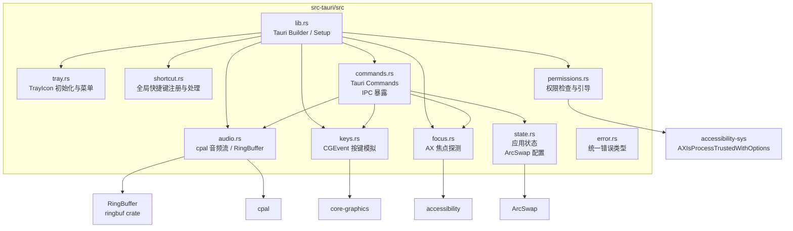

#### 4.1.2 音频采集模块 (audio.rs)

**设计目标：** 以最低延迟从麦克风捕获 16kHz Mono S16LE PCM 音频，通过无锁缓冲区传递给处理任务。

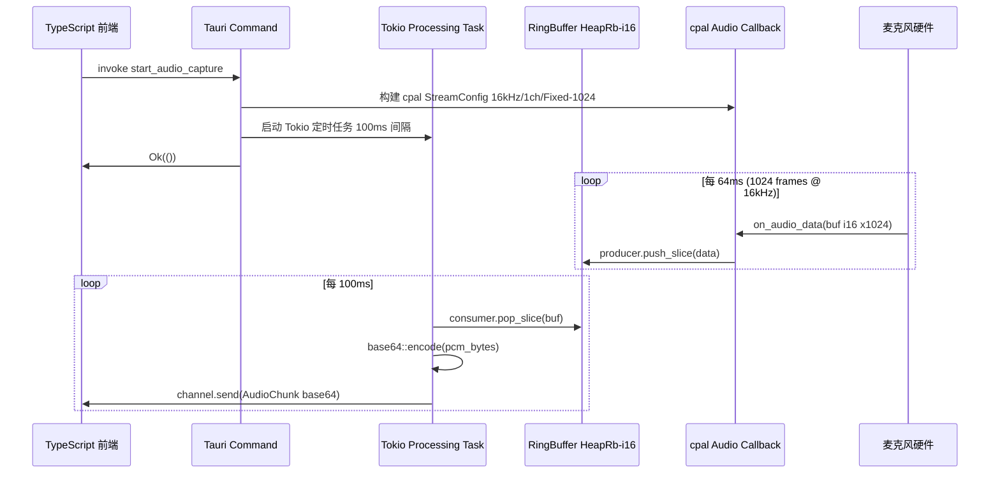

**关键设计决策：**

| 决策项 | 选择 | 原因 |
|---|---|---|
| 缓冲区大小 | `Fixed(1024)` | 1024 frames @ 16kHz = 64ms，极低延迟 |
| RingBuffer 容量 | `HeapRb::<i16>::new(8192)` | 约 512ms 缓冲，足够吸收处理延迟 |
| 处理间隔 | 100ms | 平衡延迟与 IPC 开销，对应 ~1600 bytes/chunk |
| 编码位置 | Rust 端 Base64 | 避免 IPC 传输原始二进制，利用 Rust 高性能 base64 |
| IPC 机制 | Tauri Channel | 比 emit 事件更高效的流式数据传输 |

**音频格式约束（来自 ElevenLabs API）：**

| 参数 | 值 | 说明 |
|---|---|---|
| 采样率 | 16000 Hz | `pcm_16000` 格式要求 |
| 位深度 | 16-bit | 有符号整数 (S16LE) |
| 声道数 | 1 (Mono) | 单声道 |
| 字节序 | Little-Endian | PCM 标准小端序 |

> **注意：** macOS 原生设备通常运行在 44100Hz 或 48000Hz。cpal 在请求 16kHz 时会依赖操作系统进行软件重采样。若发现延迟异常，可考虑在 Rust 端手动实现 48kHz→16kHz 的降采样滤波器。

#### 4.1.3 全局快捷键模块 (shortcut.rs)

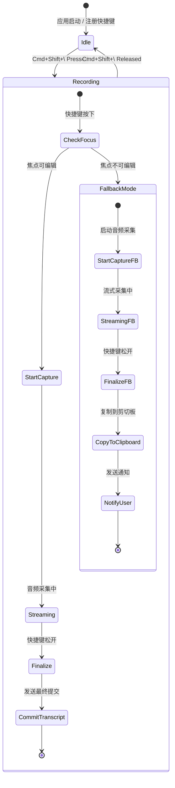

**Tauri Global Shortcut 注册方式：**

```rust
// 使用 tauri-plugin-global-shortcut v2 API
use tauri_plugin_global_shortcut::{GlobalShortcutExt, Code, Modifiers, Shortcut};

app.global_shortcut().on_shortcuts(
    ["Command+Shift+Backslash"],
    |app_handle, shortcut, event| {
        match event.state() {
            ShortcutState::Pressed => {
                app_handle.emit("shortcut-pressed", ()).ok();
            }
            ShortcutState::Released => {
                app_handle.emit("shortcut-released", ()).ok();
            }
        }
    }
)?;
```

#### 4.1.4 焦点探测模块 (focus.rs)

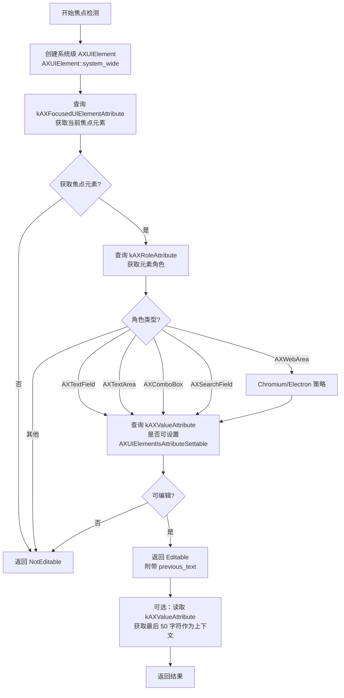

**AX API 调用链（Rust FFI）：**

```rust
// 关键 API 调用伪代码
fn detect_focus() -> FocusResult {
    let system = AXUIElement::system_wide();

    // 1. 获取焦点元素
    let focused_attr = AXAttribute::<CFType>::new(
        &CFString::from_static_string(kAXFocusedUIElementAttribute)
    );
    let focused_element = system.attribute(&focused_attr)?;

    // 2. 获取角色
    let role: CFString = focused_element.role()?;

    // 3. 判断是否可编辑
    let is_editable = match role.to_string().as_str() {
        "AXTextField" | "AXTextArea" | "AXComboBox" | "AXSearchField" => true,
        "AXWebArea" => true, // Chromium/Electron 妥协放行
        _ => false,
    };

    // 4. 进一步验证 AXUIElementIsAttributeSettable
    if is_editable {
        let settable = check_attribute_settable(&focused_element, kAXValueAttribute);
        // ...
    }

    // 5. 读取 previous_text（最后 50 字符）
    let value: CFString = focused_element.value()?;
    let previous_text = truncate(&value.to_string(), 50);
}
```

#### 4.1.5 按键模拟模块 (keys.rs)

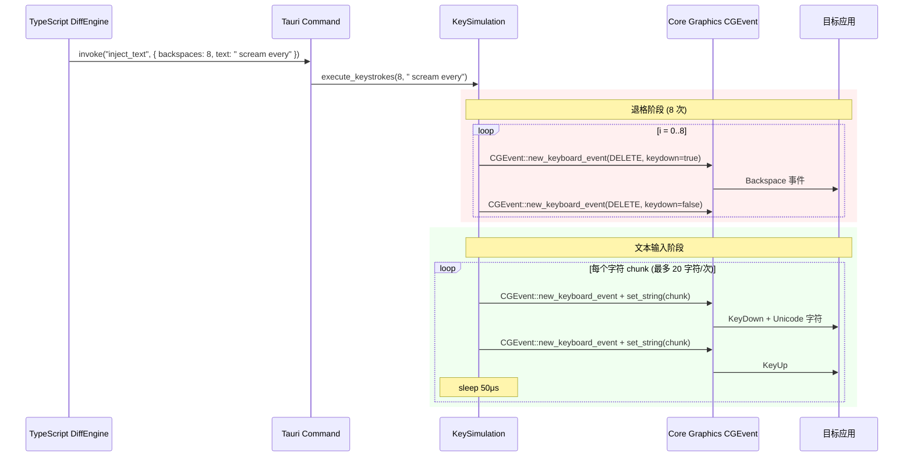

**按键模拟关键参数：**

| 参数 | 值 | 说明 |
|---|---|---|
| 退格键 KeyCode | `0x33` (51) | macOS DELETE = Backspace |
| CGEventTapLocation | `HID` | 系统级事件注入 |
| 单次 Unicode 长度上限 | 20 字符 | `CGEventKeyboardSetUnicodeString` 限制 |
| 退格间隔 | 20μs | 防止吞字 |
| 字符输入间隔 | 50μs | 平衡速度与兼容性 |
| CGEventSource | `HIDEventState` | 模拟真实硬件事件 |

#### 4.1.6 菜单栏模块 (tray.rs)

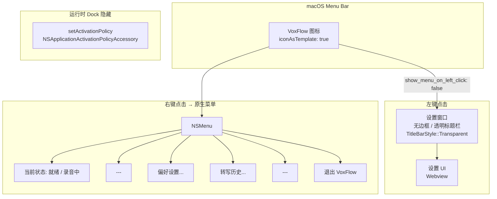

---

### 4.2 TypeScript 应用层 (src)

#### 4.2.1 模块架构

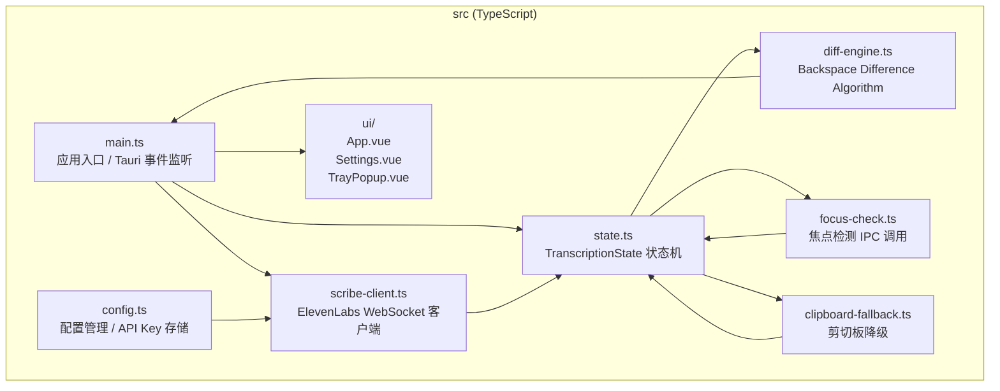

#### 4.2.2 转写状态机 (state.ts)

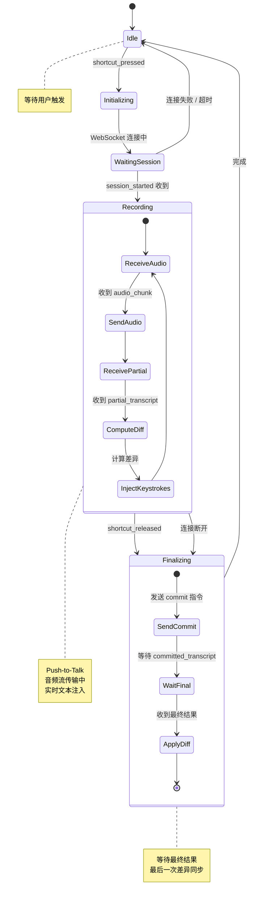

#### 4.2.3 ElevenLabs WebSocket 客户端 (scribe-client.ts)

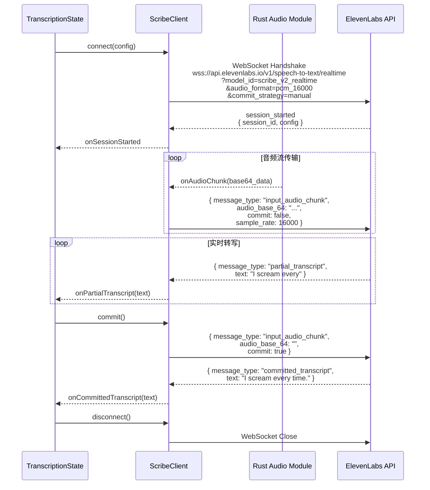

**WebSocket 连接参数：**

| 参数 | 值 | 说明 |
|---|---|---|
| Endpoint | `wss://api.elevenlabs.io/v1/speech-to-text/realtime` | Scribe v2 Realtime |
| `model_id` | `scribe_v2_realtime` | 指定模型 |
| `audio_format` | `pcm_16000` | 与 Rust cpal 配置严格对应 |
| `commit_strategy` | `manual` | 由快捷键控制生命周期 |
| `include_timestamps` | `false` | 减小负载，不需要词级时间戳 |
| `language_code` | (可选) | 可由用户在设置中指定 |
| Auth | `token` query param | 单次令牌，15 分钟有效 |

**发送音频的消息格式：**

```json
{
  "message_type": "input_audio_chunk",
  "audio_base_64": "<base64 encoded PCM S16LE>",
  "commit": false,
  "sample_rate": 16000
}
```

**首个音频块附带上下文：**

```json
{
  "message_type": "input_audio_chunk",
  "audio_base_64": "<first chunk>",
  "commit": false,
  "sample_rate": 16000,
  "previous_text": "function calculateTauri("
}
```

**手动提交：**

```json
{
  "message_type": "input_audio_chunk",
  "audio_base_64": "",
  "commit": true
}
```

---

### 4.3 ElevenLabs Scribe v2 集成层

#### 4.3.1 事件类型映射

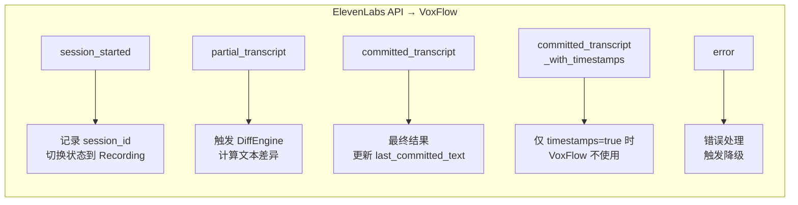

#### 4.3.2 认证流程

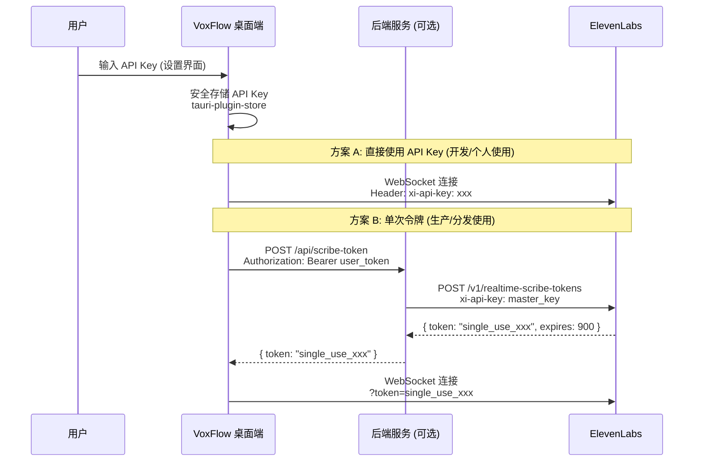

---

## 5. 数据流与 IPC 通信设计

### 5.1 IPC 通道设计

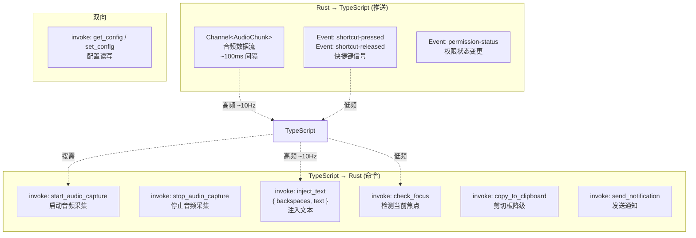

### 5.2 完整数据流时序图

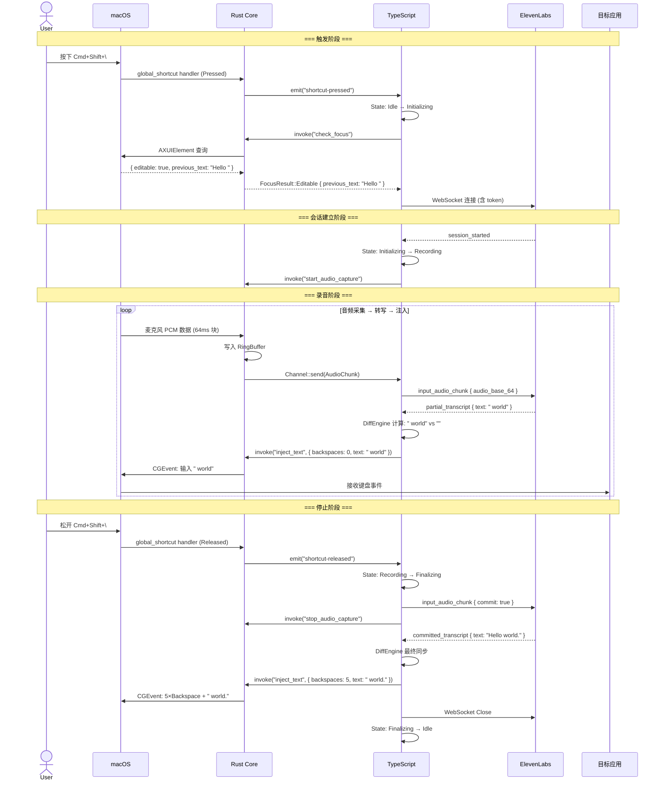

---

## 6. 核心算法设计

### 6.1 Backspace Difference Algorithm (退格差异比对算法)

这是 VoxFlow 实现实时文本"魔法"视觉效果的核心算法。由于无法直接操作第三方应用的 DOM，必须通过模拟退格键 + 字符输入来同步模型输出的变化。

#### 6.1.1 算法流程

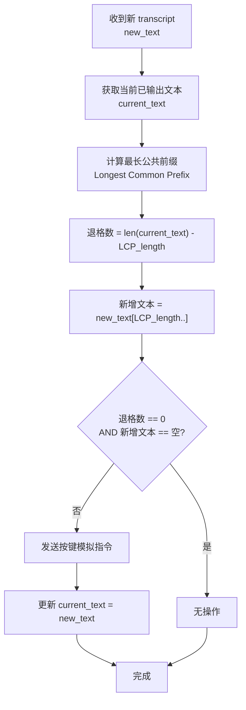

#### 6.1.2 算法伪代码

```typescript
interface DiffResult {
  backspaces: number;
  newText: string;
}

function computeDiff(currentText: string, newText: string): DiffResult {
  // Step 1: 计算最长公共前缀 (LCP)
  let lcpLength = 0;
  const minLen = Math.min(currentText.length, newText.length);
  while (lcpLength < minLen && currentText[lcpLength] === newText[lcpLength]) {
    lcpLength++;
  }

  // Step 2: 需要删除的字符数 = 当前文本剩余长度
  const backspaces = currentText.length - lcpLength;

  // Step 3: 需要追加的新文本
  const newTextToAppend = newText.slice(lcpLength);

  return { backspaces, newText: newTextToAppend };
}
```

#### 6.1.3 算法执行示例

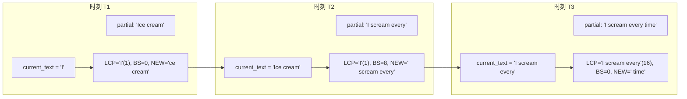

**T2 时刻详细执行过程：**

```
current_text = "Ice cream"    (9 字符)
new_text     = "I scream every" (16 字符)

LCP: 逐字符比对
  I = I  ✓ (lcpLength = 1)
  c ≠ s  ✗

backspaces = 9 - 1 = 8    (删除 "ce cream")
newText    = " scream every"

执行: 8×Backspace → 输入 " scream every"
屏幕结果: "I" + [删除"ce cream"] + " scream every" = "I scream every"
```

#### 6.1.4 算法优化策略

| 优化项 | 描述 |
|---|---|
| 节流 (Throttle) | 对 partial_transcript 事件进行 50ms 节流，避免高频触发差异计算 |
| 批量注入 | 将退格和文本合并为单次 IPC 调用，减少跨进程通信次数 |
| 最小操作剪枝 | 当 `backspaces == 0 && newText == ""` 时跳过 IPC 调用 |
| UTF-8 安全 | 正确处理多字节 Unicode 字符（如中文、Emoji），LCP 按字符而非字节计算 |

---

## 7. 权限与安全设计

### 7.1 macOS 权限矩阵

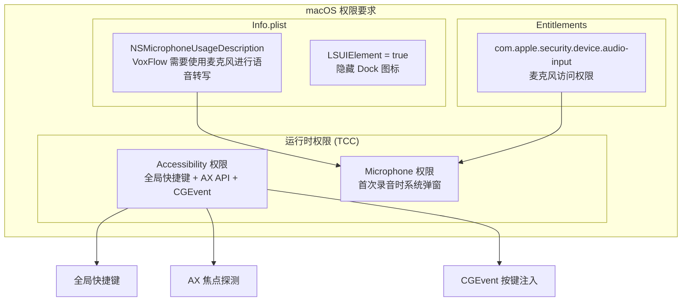

### 7.2 权限检查流程

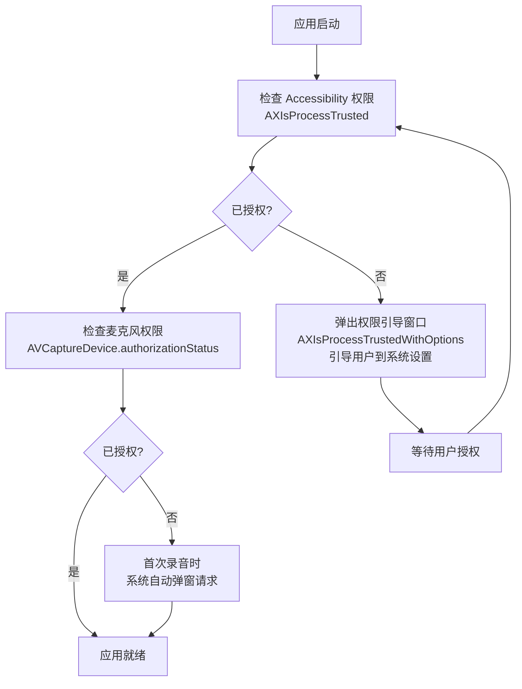

### 7.3 API Key 安全策略

| 策略 | 说明 |
|---|---|
| 存储 | 使用 `tauri-plugin-store` 加密存储在本地 |
| 传输 | WebSocket 连接使用 `wss://` 加密 |
| 令牌 | 生产环境使用单次令牌 (15 分钟有效) |
| 不打包 | 绝不将主 API Key 硬编码在客户端中 |

---

## 8. 项目目录结构

```
voxflow/
├── src-tauri/                      # Rust 核心层
│   ├── Cargo.toml                  # Rust 依赖配置
│   ├── build.rs                    # Tauri 构建脚本
│   ├── tauri.conf.json             # Tauri 应用配置
│   ├── capabilities/
│   │   └── main-capability.json    # IPC 权限声明
│   ├── icons/                      # 应用图标资源
│   │   ├── icon.icns               # macOS 图标
│   │   └── tray-icon.png           # 菜单栏图标 (Template)
│   ├── Info.plist                  # macOS Info.plist (含 LSUIElement)
│   ├── VoxFlow.entitlements        # macOS Entitlements
│   └── src/
│       ├── lib.rs                  # Tauri Builder / Setup / 入口
│       ├── tray.rs                 # 菜单栏管理
│       ├── shortcut.rs             # 全局快捷键
│       ├── audio.rs                # cpal 音频采集 + RingBuffer
│       ├── keys.rs                 # CGEvent 按键模拟
│       ├── focus.rs                # AX API 焦点探测
│       ├── permissions.rs          # 权限检查与引导
│       ├── commands.rs             # Tauri Commands (IPC 接口)
│       ├── state.rs                # 应用状态 (ArcSwap 配置)
│       └── error.rs                # 统一错误类型
│
├── src/                            # TypeScript 应用层
│   ├── main.ts                     # 应用入口
│   ├── state.ts                    # 转写状态机
│   ├── scribe-client.ts            # ElevenLabs WebSocket 客户端
│   ├── diff-engine.ts              # 退格差异比对算法
│   ├── focus-check.ts              # 焦点检测 IPC 调用
│   ├── clipboard-fallback.ts       # 剪切板降级逻辑
│   ├── config.ts                   # 配置管理
│   ├── types.ts                    # TypeScript 类型定义
│   ├── ui/                         # UI 组件
│   │   ├── App.vue                 # 根组件
│   │   ├── Settings.vue            # 设置页面
│   │   └── TrayPopup.vue           # 菜单栏弹出窗口
│   ├── styles/
│   │   └── main.css                # 全局样式
│   └── vite-env.d.ts               # Vite 类型声明
│
├── package.json                    # Node.js 依赖
├── tsconfig.json                   # TypeScript 配置
├── vite.config.ts                  # Vite 构建配置
├── index.html                      # HTML 入口
├── CLAUDE.md                       # 项目指令
├── .gitignore
└── specs/                          # 设计文档
    ├── 0001-spec.md                # 需求探索文档
    └── 0002-design.md              # 本设计文档
```

---

## 9. 关键接口定义

### 9.1 Rust Tauri Commands

```rust
/// 音频块数据结构 (通过 Channel 流式传输)
#[derive(Clone, Serialize)]
pub struct AudioChunk {
    /// Base64 编码的 PCM S16LE 音频数据
    pub base64: String,
    /// 音频时长（毫秒）
    pub duration_ms: u32,
}

/// 焦点检测结果
#[derive(Clone, Serialize)]
pub enum FocusResult {
    /// 当前焦点在可编辑文本区域
    Editable {
        /// 光标前文本（最多 50 字符），用于 previous_text
        previous_text: String,
    },
    /// 当前焦点不在可编辑区域
    NotEditable,
    /// 探测失败（如权限不足）
    DetectionFailed(String),
}

/// 文本注入指令
#[derive(Clone, Serialize, Deserialize)]
pub struct InjectTextCommand {
    /// 需要发送的退格键次数
    pub backspaces: u32,
    /// 需要输入的新文本
    pub text: String,
}

/// 应用配置
#[derive(Clone, Serialize, Deserialize)]
pub struct AppConfig {
    /// ElevenLabs API Key
    pub api_key: String,
    /// 全局快捷键 (默认 "Command+Shift+Backslash")
    pub shortcut: String,
    /// 语言代码 (可选，如 "en", "zh")
    pub language_code: Option<String>,
}
```

### 9.2 TypeScript 类型定义

```typescript
/** ElevenLabs WebSocket 消息类型 */
interface ScribeMessage {
  message_type:
    | "session_started"
    | "partial_transcript"
    | "committed_transcript"
    | "committed_transcript_with_timestamps"
    | "error";
}

interface SessionStartedMessage extends ScribeMessage {
  message_type: "session_started";
  session_id: string;
  config: {
    sample_rate: number;
    audio_format: string;
    model_id: string;
    commit_strategy: string;
  };
}

interface PartialTranscriptMessage extends ScribeMessage {
  message_type: "partial_transcript";
  text: string;
}

interface CommittedTranscriptMessage extends ScribeMessage {
  message_type: "committed_transcript";
  text: string;
}

/** 差异比对结果 */
interface DiffResult {
  backspaces: number;
  newText: string;
}

/** 转写状态 */
type TranscriptionState =
  | "idle"
  | "initializing"
  | "waiting_session"
  | "recording"
  | "finalizing";
```

---

## 10. 降级与容错策略

### 10.1 降级触发条件

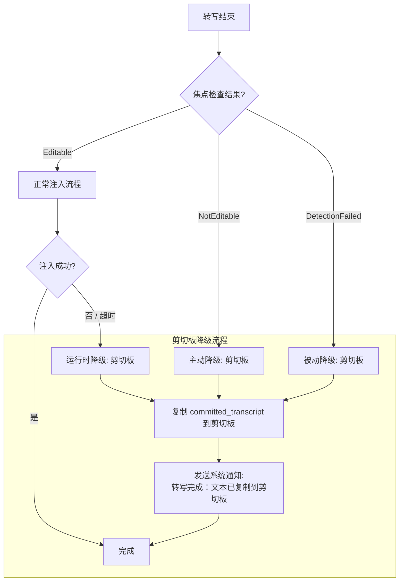

### 10.2 错误处理矩阵

| 错误场景 | 检测方式 | 处理策略 |
|---|---|---|
| 麦克风权限未授予 | cpal 打开流时错误 | 引导用户到系统设置授权 |
| Accessibility 权限未授予 | `AXIsProcessTrusted()` 返回 false | 引导用户到系统设置授权 |
| WebSocket 连接失败 | 连接超时 / HTTP 错误码 | 通知用户，回到 Idle 状态 |
| WebSocket 连接中断 | `onerror` / `onclose` 事件 | 尝试重连 1 次，失败则降级 |
| ElevenLabs API 错误 | `message_type: "error"` | 根据错误类型处理（quota / auth / rate_limit） |
| 音频设备不可用 | cpal `DevicesError` | 通知用户，回到 Idle 状态 |
| 焦点探测失败 | `FocusResult::DetectionFailed` | 降级到剪切板模式 |
| 按键注入超时 | 注入时间 > 5 秒 | 降级到剪切板模式 |
| 自动 90 秒提交 | ElevenLabs 强制提交 | 自动重新开始累积，保持连接 |
| 单次令牌过期 | 连接被服务端关闭 | 重新获取令牌，重新连接 |

---

## 11. 性能指标与约束

### 11.1 延迟预算

```mermaid
gantt
    title 端到端延迟预算 (目标 < 500ms)
    dateFormat X
    axisFormat %L ms

    section 音频采集
    麦克风 → cpal 缓冲       :a1, 0, 64
    RingBuffer 读取          :a2, 64, 100

    section 数据传输
    Base64 编码              :t1, 100, 102
    Tauri IPC Channel        :t2, 102, 107
    WebSocket 发送           :t3, 107, 120

    section 云端处理
    ElevenLabs 模型推理      :c1, 120, 270

    section 结果注入
    WebSocket 接收           :i1, 270, 275
    DiffEngine 计算          :i2, 275, 277
    IPC 命令发送             :i3, 277, 280
    CGEvent 按键注入         :i4, 280, 350

    section 总计
    端到端延迟               :done, 0, 350
```

| 阶段 | 预期延迟 | 说明 |
|---|---|---|
| 音频采集 (cpal 缓冲) | ~64ms | 1024 frames @ 16kHz |
| RingBuffer 读取间隔 | ~100ms | 定时任务间隔 |
| Base64 编码 | <2ms | Rust 端高性能编码 |
| Tauri IPC Channel | ~5ms | 进程间通信 |
| WebSocket 传输 | ~10ms | 局域网 RTT |
| ElevenLabs 模型推理 | ~150ms | 官方标称延迟 |
| DiffEngine 计算 | <2ms | LCP 算法 |
| CGEvent 按键注入 | ~70ms | 取决于文本长度 |
| **端到端总延迟** | **~350-500ms** | 首字符到首字符 |

### 11.2 资源占用目标

| 资源 | 目标值 | 说明 |
|---|---|---|
| 内存占用 | < 50MB | 对比 Electron ~200MB |
| CPU 空闲时 | < 1% | 仅菜单栏常驻 |
| CPU 录音时 | < 5% | 音频采集 + 编码 + 传输 |
| 安装包大小 | < 15MB | Tauri v2 + Rust 原生 |
| 启动时间 | < 2s | 冷启动到菜单栏就绪 |

---

## 12. 开发里程碑

```mermaid
gantt
    title VoxFlow 开发计划
    dateFormat  YYYY-MM-DD
    axisFormat  %m-%d

    section Phase 1: 基础骨架
    Tauri v2 项目初始化         :p1a, 2026-03-27, 1d
    菜单栏常驻 + Dock 隐藏      :p1b, after p1a, 1d
    全局快捷键注册              :p1c, after p1b, 1d
    设置窗口 UI 基础            :p1d, after p1c, 2d

    section Phase 2: 音频管道
    cpal 音频采集               :p2a, after p1c, 2d
    RingBuffer + Base64 编码    :p2b, after p2a, 1d
    Tauri Channel IPC 桥接      :p2c, after p2b, 1d
    麦克风权限处理              :p2d, after p2a, 1d

    section Phase 3: 转写集成
    ElevenLabs WebSocket 客户端  :p3a, after p2c, 2d
    转写状态机实现              :p3b, after p3a, 1d
    manual commit 策略          :p3c, after p3b, 1d
    previous_text 上下文注入    :p3d, after p3c, 1d

    section Phase 4: 文本注入
    AX API 焦点探测            :p4a, after p3b, 2d
    CGEvent 按键模拟           :p4b, after p4a, 2d
    DiffEngine 退格差异算法     :p4c, after p4b, 1d
    端到端集成测试             :p4d, after p4c, 2d

    section Phase 5: 降级与打磨
    剪切板降级机制             :p5a, after p4d, 1d
    系统通知                   :p5b, after p5a, 1d
    Accessibility 权限引导     :p5c, after p4a, 1d
    性能优化与压力测试          :p5d, after p5b, 2d
```

### 里程碑说明

| Phase | 目标 | 交付物 |
|---|---|---|
| **Phase 1** | 可运行的 Tauri v2 菜单栏应用骨架 | 菜单栏常驻、快捷键响应、基础设置 UI |
| **Phase 2** | 音频采集管道打通 | 麦克风采集 → RingBuffer → Base64 → IPC Channel → TypeScript |
| **Phase 3** | ElevenLabs 转写集成 | WebSocket 连接、实时转写、manual commit |
| **Phase 4** | 跨应用文本注入 | 焦点探测、按键模拟、差异算法、端到端可用 |
| **Phase 5** | 降级、容错与打磨 | 剪切板降级、权限引导、性能优化、完整可用产品 |
